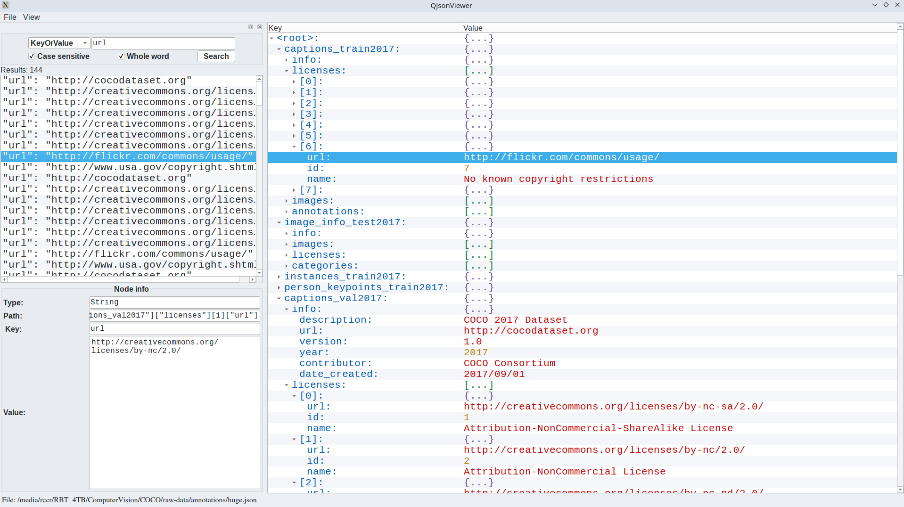

# QtJsonViewer



QtJsonViewer is a fast, dependency-light **desktop viewer for massive JSON documents** built with Qt 6.  
It uses a custom `FastJsonTree` (backed by RapidJSON) plus parallel search to keep navigation snappy even on multi‑MB payloads.  
The goal is to provide an intuitive desktop tool for developers who routinely inspect large API responses, logs, or dataset manifests.

- Color-coded tree view keeps keys, scalars, and containers easy to scan  
- Multi-mode search (key, string, number, bool, null, key+value) with instant tree navigation  
- Node inspector dock exposes the full path, key, value, and inferred type  
- Zoomable UI (8–28 pt) and recent-file menu for quick reopen  


## Usage

- **Open a JSON file** via `File → Open JSON…` (or pass a path on the CLI: `QtJsonViewer payload.json`).  
- **Browse the tree**: double-click to expand, use mouse wheel to scroll, `Ctrl +` / `Ctrl -` (or toolbar actions) to zoom text.  
- **Inspect a node**: select it to populate the Node Info dock with key, full JSON pointer path, raw value, and container size.  
- **Search**:
  - Choose a mode (Key, Value String, Value Number, Value Bool, Null, Any, or Key or Value).  
  - Configure `Case sensitive` / `Whole word` toggles (where applicable) and press **Search**.  
  - Results populate the list view; double-click an entry to expand the tree and focus that node.  
- **Tree context menu**: right-click a container node to expand/collapse entire subtrees (limited to manageable node counts).  
- **Recent files**: `File → Recent files` maintains the last 5 readable paths via `QSettings`.


## Features

- **High-performance parsing**: RapidJSON streams directly into the in-memory `FastJsonTree`, keeping allocations compact with a large pre-allocation buffer.  
- **Parallel filtering**: Search leverages `<execution>` with Intel TBB so numeric/string lookups stay responsive on deep documents.  
- **Rich previews**: Every result row shows a concise preview (type-aware) before you jump back into the tree.  
- **Smart formatting**: Keys use monospace fonts and deterministic coloring, while scalar fonts highlight booleans/nulls for instant recognition.  
- **Node metadata**: The inspector shows node type and child counts for arrays/objects, which is useful when auditing nested aggregations.  
- **CLI-friendly**: Launching `QtJsonViewer /path/to/data.json` opens directly into the provided file, which fits scripting or file manager integrations.  
- **Cross-platform Qt**: Built with Qt Widgets so it runs cleanly on Linux, Windows, and macOS (latter not yet tested).  


## License

This project is released under the [MIT License](https://opensource.org/licenses/MIT).  
See the [LICENSE](LICENSE) file for the full text.


## Requirements

- **Qt 6.5+** (tested with 6.9) with the Widgets module  
- **CMake 3.19+**  
- A **C++20** compiler (GCC, Clang, or MSVC)  
- **RapidJSON** headers available on the include path  
- **Intel TBB** (or an equivalent parallel STL backend) for the search model  
- Qt build tools such as `qt-cmake` / `Qt Creator` if you prefer the IDE workflow


## Building

```bash
git clone https://github.com/otre99/QtJsonViewer
cd QtJsonViewer/src
cmake -S . -B build -DCMAKE_BUILD_TYPE=Release
cmake --build build -j$(nproc)
```

## Usage

```bash
./build/QtJsonViewer                 # run the locally built binary
./build/QtJsonViewer payload.json    # open a document immediately

chmod +x QtJsonViewer-x86_64.AppImage
./QtJsonViewer-x86_64.AppImage huge.json
```

## Contributing

Contributions are welcome!  
Please open an issue for bugs/ideas or send a pull request with improvements.


## Acknowledgements
 - Built with Qt 6 (Fusion style, Widgets stack)
 - JSON parsing via RapidJSON
 - Parallel search backed by Intel TBB
 - AppImage packaging powered by linuxdeploy and Qt deploy scripts
